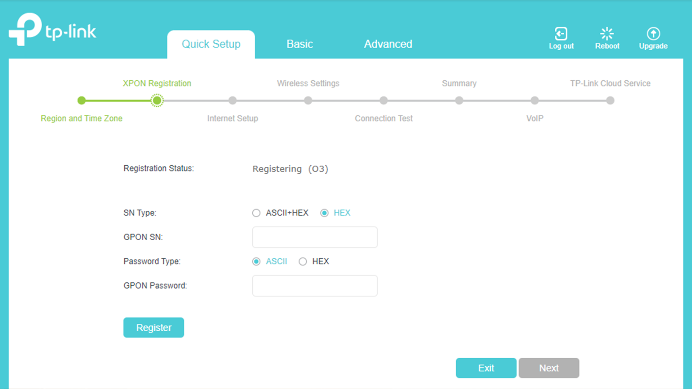
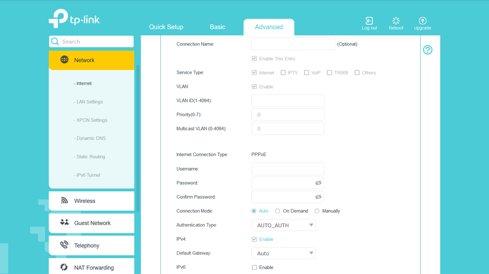
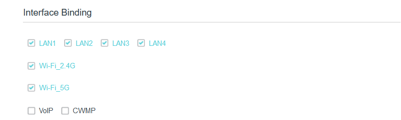

# Configuration
This section will help you configure your device. This does not mean a complete configuration, but rather the things you need to successfully configure the device.

> [!NOTE]
> This is for information purpose only.

You can always ask your ISP to configure the device for you. In case the device doesn't work after the configuration, you can delete the configurations and try again or contact your ISP.

> [!IMPORTANT]
> Doing a device reset will require you to contact the ISP because they will have to add the device to their network again.

## Registering the Device
The first place you are likely to get stuck on is the $${\color{aquamarine}XPON \space Registration}$$. This step cannot be completed from the consumer end.
Send a picture of the back of your router to your ISP or send the MAC address of your device to the ISP. This will let them add the device to their network, thereby registering your device.

> [!IMPORTANT]
> Configurations mentioned here are not done in the initial basic setup. They are done after the basic setup, in the advanced section. You can go through the process and try to do it with the basic as well if you prefer.

## Configuring Internet
First Delete all existing configurations (This is recommended).

+ Add a new configuration.
+ Leave the connection name empty or give a desired name.
+ Make sure "Enable This Entry" is checked.
+ Tick **"Internet"** as the $${\color{aquamarine}Service \space Type}$$.
+ Tick "Enable" next to $${\color{aquamarine}VLAN}$$.
+ Leave $${\color{aquamarine}Priority}$$ and $${\color{aquamarine}Multicast \space VLAN}$$ as is.
+ $${\color{aquamarine}Internet \space Connection \space Type}$$ is PPPoE
+ Enter your $${\color{aquamarine}Username}$$ and $${\color{aquamarine}Password}$$ (These are provided by the ISP).
+ Confirm your password.
+ $${\color{aquamarine}Connection \space Mode}$$ must be "Auto".
+ Leave everything else as is.

+ For the interface binding, tick all the boxes except VoIP and CWMP.
+ Leave the rest as is.

## Configuring VoIP
{This section is being worked on.}
