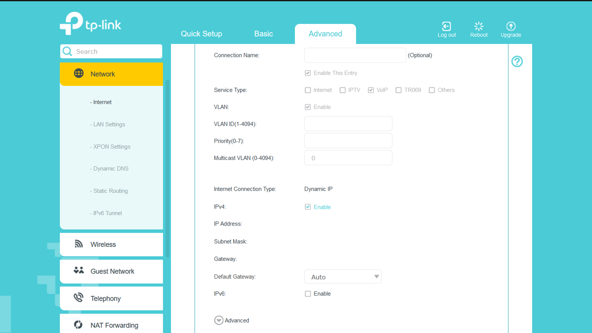
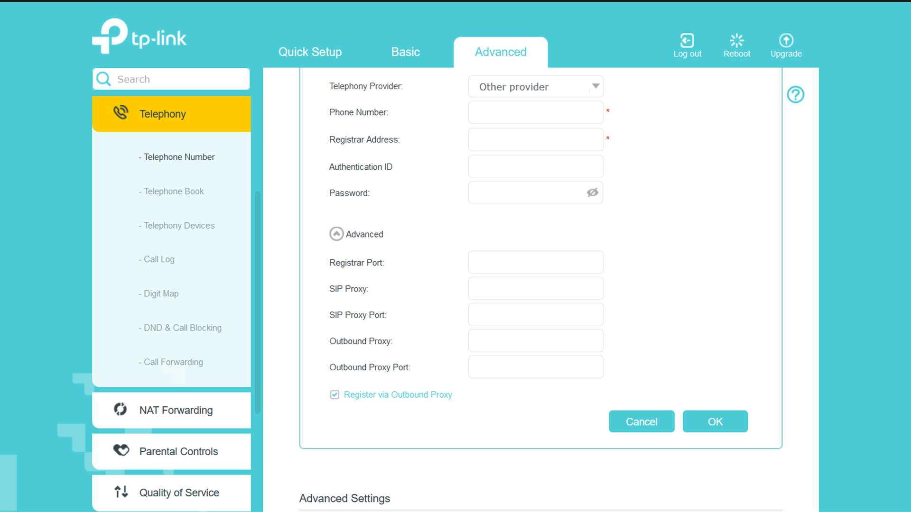

# Configuration
This section will help you configure your device. This does not mean a complete configuration, but rather the things you need to successfully configure the device.

> [!NOTE]
> This is for information purpose only.

You can always ask your ISP to configure the device for you. In case the device doesn't work after the configuration, you can delete the configurations and try again or contact your ISP.

> [!IMPORTANT]
> Doing a device reset will require you to contact the ISP because they will have to add the device to their network again.

## Registering the Device
The first place you are likely to get stuck on is the $${\color{aquamarine}XPON \space Registration}$$. This step cannot be completed from the consumer end.
Send a picture of the back of your router to your ISP or send the MAC address of your device to the ISP. This will let them add the device to their network, thereby registering your device.

> [!IMPORTANT]
> Configurations mentioned here are not done in the initial basic setup. They are done after the basic setup, in the advanced section. You can go through the process and try to do it with the basic as well if you prefer.

## Configuring Internet
First Delete all existing configurations (This is recommended).

+ Add a new configuration.
+ Leave the connection name empty or give a desired name.
+ Make sure "Enable This Entry" is checked.
+ Tick **"Internet"** as the $${\color{aquamarine}Service \space Type}$$.
+ Tick "Enable" next to $${\color{aquamarine}VLAN}$$.
+ Enter your $${\color{aquamarine}VLAN \space ID}$$ (This is provided by your ISP).
+ Leave $${\color{aquamarine}Priority}$$ and $${\color{aquamarine}Multicast \space VLAN}$$ as is.
+ $${\color{aquamarine}Internet \space Connection \space Type}$$ is "PPPoE".
+ Enter your $${\color{aquamarine}Username}$$ and $${\color{aquamarine}Password}$$ (These are provided by the ISP).
+ Confirm your password.
+ $${\color{aquamarine}Connection \space Mode}$$ must be "Auto".
+ Leave everything else as is.

+ For the $${\color{aquamarine}Interface \space Binding}$$, tick all the boxes except VoIP and CWMP.
+ Leave the rest as is.

## Configuring VoIP
Right in the Advanced section of Internet, under Network, add another configuration.

+ Leave the connection name empty or give a desired name.
+ Make sure "Enable This Entry" is checked.
+ Tick **"VoIP"** as the $${\color{aquamarine}Service \space Type}$$.
+ Tick "Enable" next to $${\color{aquamarine}VLAN}$$.
+ Enter your $${\color{aquamarine}VLAN \space ID}$$ (This is provided by your ISP and might be different from the VLAN ID used in Internet configuration).
+ Leave $${\color{aquamarine}Priority}$$ and $${\color{aquamarine}Multicast \space VLAN}$$ as is.
+ Change the $${\color{aquamarine}Internet \space Conenction \space Type}$$ to "Dynamic IP".
+ Leave the rest as is.

+ For the $${\color{aquamarine}Interface \space Binding}$$, tick VoIP.

> [!CAUTION]
> The Internet Binding might uncheck itself after the Telephony configuration. Make sure to come back to "Network" and modify the configuration and recheck the binding.

## Telephony Configuration
Next is the Telephone Number Configuration.

Head over to Telephony in the sidebar and from there, Telephone Number.

+ Change $${\color{aquamarine}Telephony \space Provider}$$ to "Other Provider" in case of BSNL or pick your provider from the dropdown.
+ Enter your $${\color{aquamarine}Phone \space Numebr}$$
        The Phone number follows the format: `00913457777777`.
        |00|91|345|7777777|
        |:--:|:--:|:--:|:--:|
        |Need to add the zeroes|Country code|Area STD code without the first 0|Telephone Number|
+ Enter your $${\color{aquamarine}Registrar \space Address}$$ (This has to be provided by your ISP).
+ Enter your $${\color{aquamarine}Authentication \space ID}$$ (If your ISP cannot provide this or is confused, put in the phone number you entered above in this section).
+ Enter your $${\color{aquamarine}Password}$$ (This has to be provided by your ISP as well).
+ In the Advanced Section, leave the $${\color{aquamarine}Registrar \space Port}$$, $${\color{aquamarine}SIP \space Proxy \space Port}$$ and $${\color{aquamarine}Outbound \space Proxy \space Port}$$ as is, unless directed otherwise by your ISP.
+ The $${\color{aquamarine}SIP \space Proxy}$$ and $${\color{aquamarine}Outbound \space Proxy}$$ will be provided by the ISP and is usually the same as the $${\color{aquamarine}Registrar \space Address}$$.

+ Leave the second $${\color{aquamarine}Advanced \space Settings}$$ as is.
+ Head back over to Internet and Network to see if the VoIP Interface binding still has VoIP checked. If it's unchecked, check it again and save it.

---

That's it. If you followed through properly, your device should be properly configured with both Internet and VoIP.
