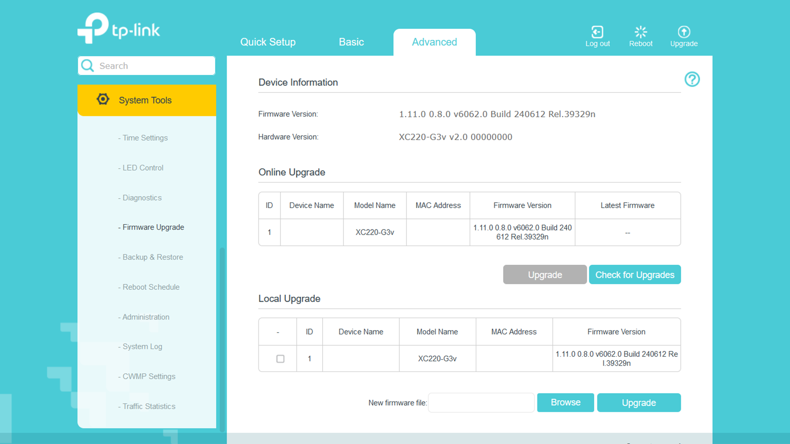

# How to upgrade firmware?
This part explains how to upgrade your firmware, considering you can already access the admin page of the device. Ensure that your device will stay powered on throughout the process.

Head on over to the admin page.

Choose $${\color{lightblue}Advanced}$$ on the main navigation bar.

On the sidebar, select $${\color{lightblue}System \space Tools}$$.

From there, head to $${\color{lightblue}Firmware \space Upgrade}$$.

Scroll down to the bottom of the page where you can find $${\color{lightblue}Local \space Upgrade}$$.

Tick the checkbox near your device name.

Next to the **New firmware file** at the bottom, you will see an option to $${\color{lightblue}Browse}$$. Click on that and browse to the destination where you have the firmware upgrade file and open it using the file manager.

Click on $${\color{lightblue}Upgrade}$$.

The Firmware Upgrade page should look like this (do tick the checkbox though):

> [!CAUTION]
> This process will take a while and you have to ensure that the device will stay plugged in and powered on throughout the upgrade process.
